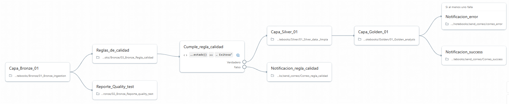

# Proyecto de Análisis de Riesgo Crediticio

Este proyecto implementa un flujo de trabajo ETL (Extracción, Transformación y Carga) en Databricks para procesar y analizar datos de riesgo crediticio. El objetivo es transformar datos crudos en información valiosa y estructurada, lista para el análisis y la generación de reportes, siguiendo las mejores prácticas de la arquitectura Medallion.

---

## 1. Objetivo del Proyecto

El propósito principal es evaluar el riesgo crediticio a partir de un conjunto de datos inicial. El proceso refina progresivamente los datos a través de varias capas de calidad y transformación para facilitar el análisis final, la creación de modelos de machine learning o la visualización en herramientas de Business Intelligence.

---

## 2. Origen de los Datos

Los datos utilizados en este proyecto provienen del conjunto "Credit Risk Dataset" publicado en Kaggle. El archivo principal incluido en este repositorio es `data/credit_risk_dataset.csv`.

Fuente original:

- Kaggle — Credit Risk Dataset: https://www.kaggle.com/datasets/laotse/credit-risk-dataset

---

## 3. Arquitectura Medallion

El proyecto está estructurado siguiendo la arquitectura Medallion, un enfoque de diseño que garantiza la calidad, trazabilidad y robustez de los datos a través de tres capas principales:

*   **Capa Bronze (Bronce):** Contiene los datos en su estado más crudo, ingeridos desde las fuentes originales con mínimas transformaciones. Sirve como un archivo histórico y un punto de partida para el resto del flujo.
*   **Capa Silver (Plata):** Almacena datos que han sido limpiados, validados, estandarizados y enriquecidos. En esta capa, los datos de la capa Bronze se combinan y transforman para crear una vista empresarial coherente.
*   **Capa Gold (Oro):** Contiene datos agregados y listos para el consumo. Estas tablas están diseñadas para responder a necesidades específicas de negocio, como análisis, reportes y alimentación de modelos de ML.

---

## 4. Flujo de Trabajo ETL

El flujo de trabajo se orquesta mediante una secuencia de notebooks de Databricks, cada uno con una responsabilidad específica dentro del proceso ETL.

### Capa Bronze: Ingesta y Calidad de Datos
1.  **Ingestión (`01_Bronze_ingestion.ipynb`):**
    *   Carga el conjunto de datos `credit_risk_dataset.csv` desde la fuente.
    *   Guarda los datos crudos en una tabla Delta en la capa Bronze.

2.  **Pruebas de Calidad (`02_Bronze_Reporte_quality_test.ipynb`):**
    *   Ejecuta un conjunto de pruebas de calidad sobre los datos brutos (e.g., completitud, unicidad, distribución de valores).
    *   Genera un reporte de calidad de datos.

3.  **Aplicación de Reglas (`03_Bronze_Regla_calidad.ipynb`):**
    *   Aplica reglas de negocio para validar y marcar registros que no cumplen con los criterios de calidad establecidos.

### Capa Silver: Limpieza y Transformación
1.  **Limpieza de Datos (`01_Silver_data_limpia.ipynb`):**
    *   Consume los datos validados de la capa Bronze.
    *   Realiza operaciones de limpieza, como el manejo de valores nulos, la corrección de tipos de datos y la estandarización de campos.
    *   Almacena la tabla resultante y limpia en la capa Silver.

### Capa Gold: Análisis y Consumo
1.  **Análisis Agregado (`01_Golden_analysis.ipynb`):**
    *   Utiliza los datos limpios de la capa Silver.
    *   Crea tablas agregadas con métricas de negocio clave para el análisis de riesgo crediticio.
    *   Estos datos están optimizados para la consulta y visualización.

### Tareas Complementarias: Notificaciones
El flujo incluye notebooks para enviar notificaciones por correo electrónico sobre el estado de la ejecución del pipeline:
*   `Correo_success.ipynb`: Notifica cuando el flujo de trabajo se ha completado exitosamente.
*   `correo_error.ipynb`: Envía una alerta si ocurre un error en alguna de las tareas.
*   `Correo_regla_calidad.ipynb`: Informa sobre los resultados de las validaciones de calidad de datos.

---

## 5. Imágenes (carpeta `imagenes`)

Las imágenes incluidas en la carpeta `imagenes` se describen a continuación para facilitar su localización y uso en documentación o presentaciones:

- `Ejecuciones.png`: Captura o diagrama relacionado con las ejecuciones del pipeline (por ejemplo historial de runs, estado de tareas o pantallazo de la consola de orquestación).

- `Tareas.png`: Diagrama de las tareas o flujo de trabajo, mostrando las etapas principales del pipeline (ingesta, pruebas de calidad, limpieza, análisis, notificaciones).

---

## 6. Tecnologías Utilizadas

*   **Plataforma:** Databricks
*   **Procesamiento de Datos:** Apache Spark
*   **Lenguaje:** Python (PySpark)
*   **Formato de Tablas:** Delta Lake
*   **Orquestación:** Databricks Workflows

---

## 7. Estructura del Proyecto

La estructura principal del proyecto es la siguiente (rutas relativas al repositorio):

- `data/`
    - `credit_risk_dataset.csv`  (dataset original utilizado en los notebooks)
- `imagenes/`
    - `Ejecuciones.png`
    - `Tareas.png`
- `notebooks/`
    - `Bronze/`
        - `01_Bronze_ingestion.ipynb`
        - `02_Bronze_Reporte_quality_test.ipynb`
        - `03_Bronze_Regla_calidad.ipynb`
    - `Silver/`
        - `01_Silver_data _limpia.ipynb`
    - `Golden/`
        - `01_Golden_analysis.ipynb`
    - `send_correo/`
        - `correo_error.ipynb`
        - `Correo_regla_calidad.ipynb`
        - `Correo_success.ipynb`

